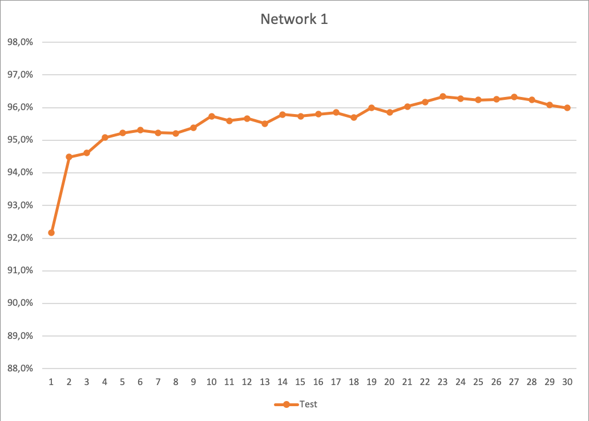
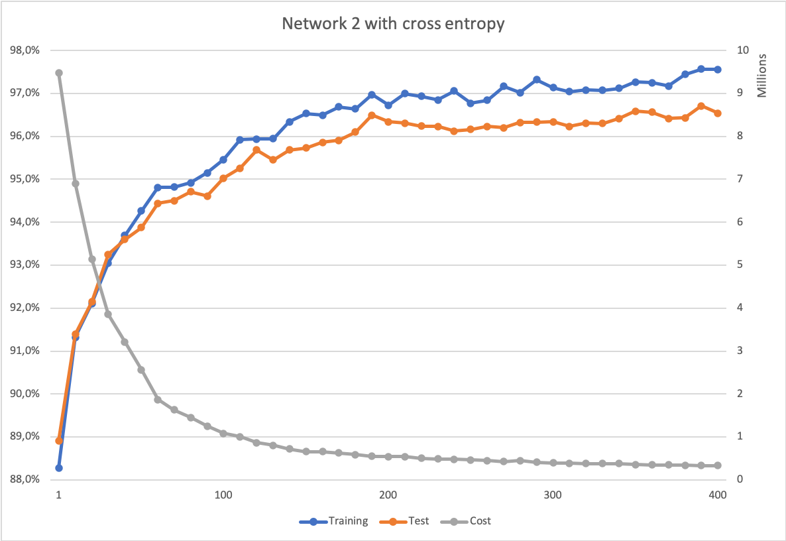

# neural-networks-and-deep-learning-in-golang

Code freely adaptated from Michael Nielsen's ["Neural Networks and Deep Learning"](http://neuralnetworksanddeeplearning.com/) book in Go.

_NB: Instead of using the 'mnist.pkl.gz' file, I used the MNIST set [in CSV](https://pjreddie.com/projects/mnist-in-csv/) as provided by Joseph Redmon and zipped the test and the train sets in the 'data' folder._


### Motivation

In order to practice neural networks in Go, I decided to make my own adaptation of Michael Nielsen's reference book on the subject.
Note that it's neither optimized nor production ready: it's just an adaptation to stay as close as possible to his Python code. Don't view this as some kind of Go reference on the subject, but just as a small exercise.

A few notes on the results:
* For the first implementation (eq. `network.py`), the best results were reached by using 300 instead of 30 neurons in the hidden layer, which seems more coherent to results found by other researchers<a name="footnote1"><sup>1</sup></a> in the field for the same kind of network;



* Results on the second implementation (eq. `network2.py`) finally went as high as the original implementation, but it took more epochs (rather 400 than 30), and a change of eta value (from 0.12 to 0.5) after the first 30 epochs, and still 300 neurons in the hidden layer;



* // TODO.


### Installation

```console
$ git clone https://github.com/cyrildever/neural-networks-and-deep-learning-in-golang.git
$ cd neural-networks-and-deep-learning-in-golang
$ go build
```


### Usage

```console
$ ./neuraldeep -n=1 -op=train -layers=784,300,10 -data=training -useMNIST=true -epochs=30 -size=10 -eta=3.0 -load=false -eval=true
```

```
Usage of ./neuraldeep:
  -cost string
        cost function: crossEntropy | quadratic (default "crossEntropy")
  -data string
        a single data set to feed the first layer (a comma-separated list of float64), or the name of the MNIST set (test | training | validation)
  -epochs int
        number of epochs (default 1)
  -eta float
        learning rate (default 0.1)
  -eval true
        set to true to add evaluation at each training epoch
  -label string
        the label/target of the passed value as a float64 number
  -lambda float
        the regularization parameter
  -layers string
        comma-separated list of number of neurons per layer (the first one being the size of the input layer)
  -load true
        set to true if you want to load an existing network
  -n string
        the network implementation to use: 1 | 2 | 3 (default "1")
  -op string
        operation to proceed: predict | test | train
  -path string
        path to the existing file (default "./data/saved/network/")
  -size int
        mini-batch size (default 10)
  -src string
        the source file to use as input data
  -mnist
        set to true to use MNIST dataset (the layers flag should start with 784 and end with 10)
```


## License

The code in Go is distributed under an [MIT license](LICENSE).
Please see [Michael Nielsen's website](http://neuralnetworksanddeeplearning.com/) for his authorization.


<hr />
&copy; 2020 Cyril Dever. All rights reserved.

---

<sup>[1](#footnote1)</sup>: Stuart Russell, Peter Norvig, "Artificial Intelligence: A Modern Approach", 3rd Edition.
